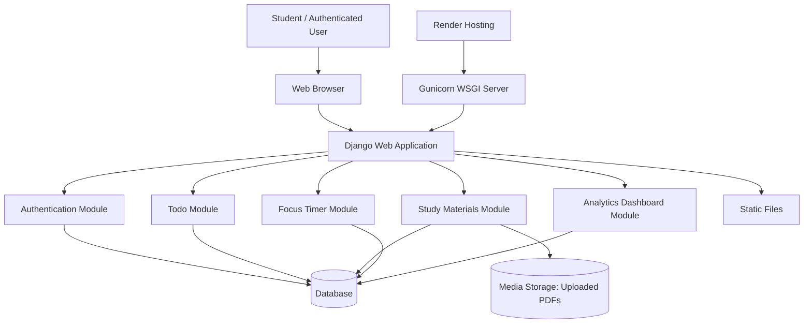
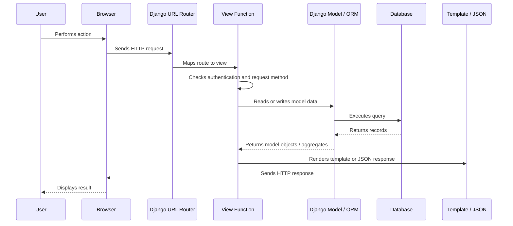
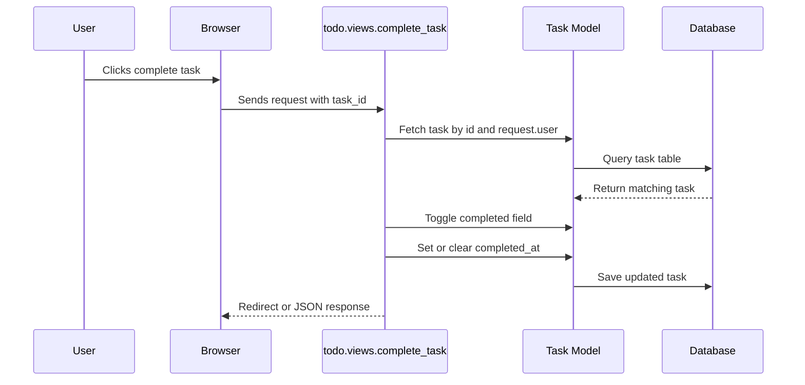
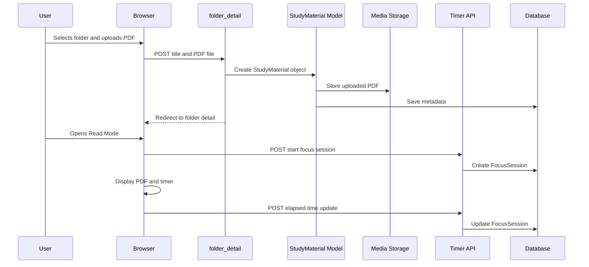
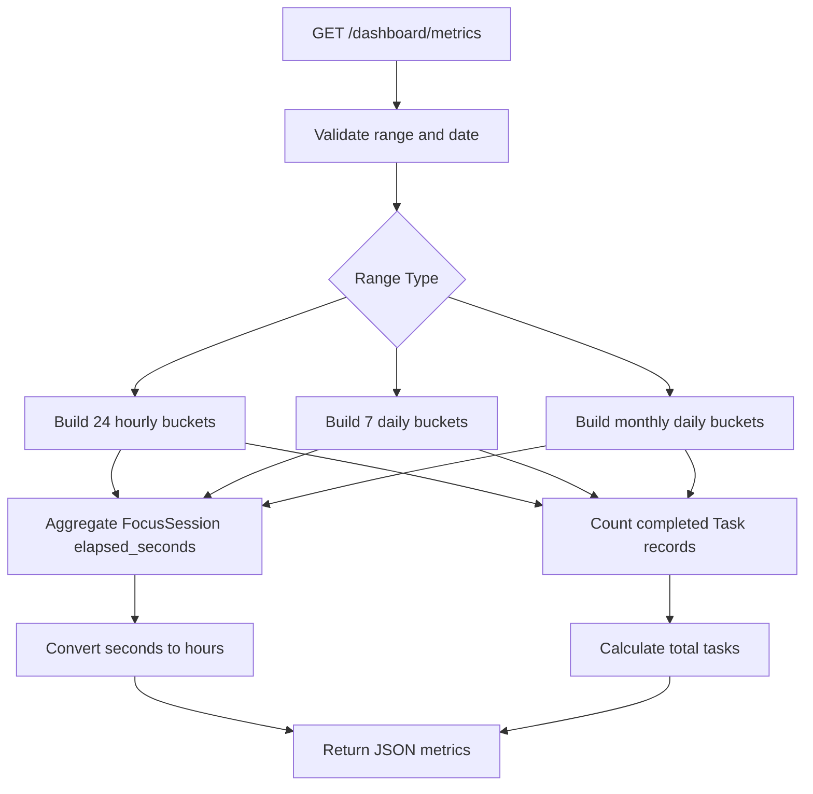
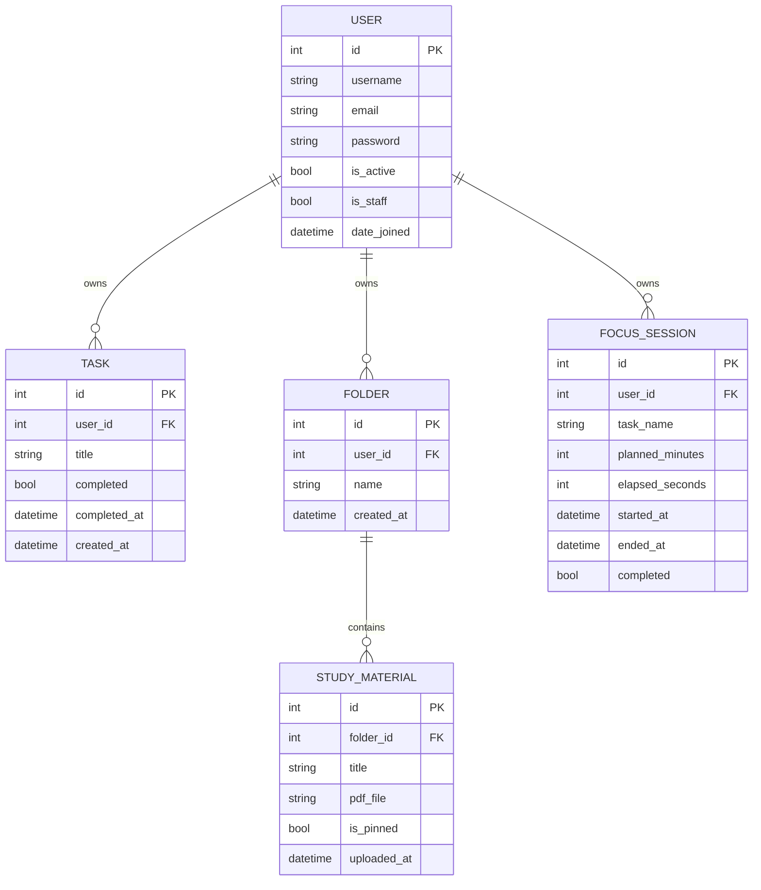

# Software Requirements Specification

## Prodify - Productivity Platform and Community Learning Support System

**Version:** 1.0  
**Prepared for:** Prodify Productivity Platform  
**Technology Stack:** Python, Django, HTML, CSS, SQLite/PostgreSQL-compatible deployment  
**Deployment Target:** Render Web Service  

---

## 1. Introduction

### 1.1 Purpose

This Software Requirements Specification (SRS) defines the functional, non-functional, architectural, and data requirements for **Prodify**, a web-based productivity and study-management platform. The document is intended for developers, evaluators, project reviewers, deployment maintainers, and future contributors who need a clear understanding of the system behavior and design.

Prodify helps students and self-learners manage their academic workflow through task tracking, PDF-based study material organization, focus timer sessions, and progress analytics.

### 1.2 Scope

Prodify is a Django web application that provides authenticated users with a personal productivity workspace. The system currently supports:

- User registration, login, logout, and profile access.
- Task creation, completion tracking, deletion, and progress count.
- Folder-based study material management.
- PDF upload, PDF viewing, pinning, deletion, and read mode.
- Focus timer sessions with planned duration and elapsed-time tracking.
- Dashboard analytics for study hours and completed tasks by day, week, or month.
- Static and deployment configuration for Render hosting.

The application is primarily designed for students who need a simple, centralized platform for organizing study work and measuring learning consistency.

### 1.3 Definitions and Abbreviations

| Term | Meaning |
| --- | --- |
| SRS | Software Requirements Specification |
| UI | User Interface |
| DB | Database |
| CRUD | Create, Read, Update, Delete |
| PDF | Portable Document Format |
| ORM | Object Relational Mapper |
| WSGI | Web Server Gateway Interface |
| CSRF | Cross-Site Request Forgery |
| HLD | High-Level Design |
| LLD | Low-Level Design |

---

## 2. Problem Statement

Students often use separate tools for managing tasks, storing study resources, timing focused study sessions, and tracking productivity. This fragmented workflow creates several problems:

- Study materials are scattered across devices, folders, chats, and cloud drives.
- Tasks are not linked to measurable study behavior.
- Students may start focused sessions but lack historical progress tracking.
- Productivity data is difficult to visualize without manual tracking.
- Simple study tools often solve only one problem, forcing learners to switch contexts repeatedly.

This leads to reduced consistency, weak progress visibility, and difficulty maintaining a disciplined study routine.

---

## 3. Problem Solved by Prodify

Prodify solves this problem by combining essential study-productivity features into one web platform. It gives users a single authenticated workspace where they can plan work, store learning resources, run focused study sessions, and view measurable progress.

The platform solves the problem in the following ways:

- **Centralized task management:** Users can create, complete, and delete personal tasks.
- **Organized learning resources:** Users can create folders and upload PDFs into structured study material collections.
- **Focused reading workflow:** Users can open PDFs in read mode and start a focus session directly from study material.
- **Time tracking:** Focus sessions store planned minutes, elapsed seconds, completion status, start time, and end time.
- **Progress analytics:** The dashboard aggregates completed tasks and study hours across selected date ranges.
- **Authenticated privacy:** User-specific records are protected through Django authentication and query filtering.

---

## 4. Product Perspective

Prodify is a server-rendered Django web application. It uses Django templates for UI rendering, Django views for request handling, Django ORM models for persistence, and Django authentication for user management.

The application can run locally with SQLite and can be deployed using a production environment with Render. The settings support environment-based configuration for secret key, debug mode, allowed hosts, static files, and database URL.

---

## 5. Users and Roles

### 5.1 Anonymous User

An anonymous user can:

- View the landing/home page.
- Register a new account.
- Log in using valid credentials.

### 5.2 Authenticated User

An authenticated user can:

- Access profile, todo, timer, dashboard, and study material pages.
- Create and manage personal tasks.
- Create folders for study material.
- Upload and view PDFs.
- Pin and delete study materials.
- Start and update focus sessions.
- View productivity analytics.

### 5.3 Admin User

An admin user can:

- Access Django admin if configured with superuser credentials.
- Manage application records through the Django admin interface.

---

## 6. Functional Requirements

### 6.1 Authentication Module

| ID | Requirement |
| --- | --- |
| FR-AUTH-01 | The system shall allow new users to register with username, email, and password. |
| FR-AUTH-02 | The system shall validate registration data using Django's user creation form rules. |
| FR-AUTH-03 | The system shall allow registered users to log in. |
| FR-AUTH-04 | The system shall allow authenticated users to log out. |
| FR-AUTH-05 | The system shall restrict protected pages to authenticated users only. |
| FR-AUTH-06 | The system shall redirect authenticated users to configured pages after login/logout. |

### 6.2 Todo Module

| ID | Requirement |
| --- | --- |
| FR-TODO-01 | The system shall allow authenticated users to create a task with a title. |
| FR-TODO-02 | The system shall display only the tasks belonging to the logged-in user. |
| FR-TODO-03 | The system shall allow users to toggle task completion status. |
| FR-TODO-04 | The system shall record completion timestamp when a task is marked completed. |
| FR-TODO-05 | The system shall clear completion timestamp when a task is marked incomplete. |
| FR-TODO-06 | The system shall allow users to delete their own tasks. |
| FR-TODO-07 | The system shall display total task count and completed task count. |
| FR-TODO-08 | The system shall support AJAX responses for task operations where applicable. |

### 6.3 Study Material Module

| ID | Requirement |
| --- | --- |
| FR-STUDY-01 | The system shall allow authenticated users to create study folders. |
| FR-STUDY-02 | The system shall display only folders owned by the logged-in user. |
| FR-STUDY-03 | The system shall allow users to upload PDF files into a selected folder. |
| FR-STUDY-04 | The system shall store uploaded files using the configured media storage path. |
| FR-STUDY-05 | The system shall list uploaded materials inside their folder. |
| FR-STUDY-06 | The system shall allow users to select and view a PDF. |
| FR-STUDY-07 | The system shall allow users to pin or unpin a study material. |
| FR-STUDY-08 | The system shall allow users to delete study materials they own. |
| FR-STUDY-09 | The system shall prevent users from accessing folders or materials owned by another user. |

### 6.4 Focus Timer Module

| ID | Requirement |
| --- | --- |
| FR-TIMER-01 | The system shall show predefined focus duration options. |
| FR-TIMER-02 | The system shall allow authenticated users to start a focus session. |
| FR-TIMER-03 | The system shall store the session owner, task name, planned minutes, and start time. |
| FR-TIMER-04 | The system shall allow clients to update elapsed seconds for a session. |
| FR-TIMER-05 | The system shall mark a session completed when completion data is submitted. |
| FR-TIMER-06 | The system shall store an end timestamp for completed sessions. |
| FR-TIMER-07 | The system shall reject updates to sessions that do not belong to the logged-in user. |

### 6.5 Dashboard Module

| ID | Requirement |
| --- | --- |
| FR-DASH-01 | The system shall provide a dashboard page for authenticated users. |
| FR-DASH-02 | The system shall expose dashboard metrics as JSON. |
| FR-DASH-03 | The system shall support day, week, and month ranges. |
| FR-DASH-04 | The system shall aggregate focus session elapsed seconds into study hours. |
| FR-DASH-05 | The system shall aggregate completed tasks by completion date or hour. |
| FR-DASH-06 | The system shall return labels, study hours, tasks done, and summary totals. |
| FR-DASH-07 | The system shall fall back to the current local date for invalid or missing dates. |

---

## 7. Non-Functional Requirements

### 7.1 Security

- The system shall use Django authentication for login-protected pages.
- The system shall use CSRF protection for form and POST requests.
- The system shall read production secret values from environment variables.
- The system shall support secure cookie settings in production.
- The system shall restrict database queries by authenticated user where personal data is involved.
- The system should enforce POST-only behavior for destructive operations such as delete and toggle actions.

### 7.2 Performance

- The system shall render standard pages within acceptable web response time for small to medium personal datasets.
- Dashboard queries shall aggregate data using database-level grouping where possible.
- Static files shall be served through WhiteNoise in production deployment.

### 7.3 Reliability

- The system shall validate missing or invalid dashboard dates gracefully.
- The system shall not expose records belonging to other users.
- Focus session elapsed time updates shall not reduce already stored elapsed time.

### 7.4 Maintainability

- The project shall follow Django app separation: accounts, todo, study_materials, timer, and dashboard.
- Deployment configuration shall be maintained through `render.yaml`, `build.sh`, and environment variables.
- Dependencies shall be declared in `prodify/requirements.txt`.

### 7.5 Portability

- The system shall run locally using SQLite.
- The system shall support production database configuration through `DATABASE_URL`.
- The system shall be deployable to Render using Gunicorn and WSGI.

---

## 8. System Architecture

### 8.1 High-Level Architecture Diagram



### 8.2 High-Level Component Description

| Component | Responsibility |
| --- | --- |
| Browser | Displays pages, submits forms, triggers AJAX requests, and renders dashboard data. |
| Django Project | Central request routing, settings, middleware, templates, and WSGI application. |
| Accounts App | Handles registration, home page, profile page, and authentication integration. |
| Todo App | Manages personal tasks and completion tracking. |
| Study Materials App | Manages folders, uploaded PDFs, PDF selection, pinning, and deletion. |
| Timer App | Creates and updates focus sessions. |
| Dashboard App | Aggregates task and study-session data for visual analytics. |
| Database | Stores users, tasks, folders, study materials, and focus sessions. |
| Media Storage | Stores uploaded PDF files. |
| Render/Gunicorn | Hosts and runs the production web service. |

---

## 9. Low-Level Design

### 9.1 Django Request Flow



### 9.2 Task Completion Flow



### 9.3 Study Material Upload and Read Mode Flow



### 9.4 Dashboard Metrics Flow



---

## 10. Database ER Diagram



### 10.1 Entity Description

| Entity | Description |
| --- | --- |
| User | Built-in Django user model used for authentication and ownership. |
| Task | A personal todo item created by a user. |
| Folder | A user-owned container for study material. |
| StudyMaterial | A PDF resource uploaded inside a folder. |
| FocusSession | A timed study/work session belonging to a user. |

### 10.2 Relationships

| Relationship | Cardinality | Description |
| --- | --- | --- |
| User to Task | One-to-many | One user can own many tasks. |
| User to Folder | One-to-many | One user can create many study folders. |
| Folder to StudyMaterial | One-to-many | One folder can contain many uploaded PDFs. |
| User to FocusSession | One-to-many | One user can record many focus sessions. |

---

## 11. Data Requirements

### 11.1 Task Data

- Each task must have an owner.
- Each task must have a title of up to 200 characters.
- Each task must maintain completion state.
- Completed tasks should store the completion timestamp.

### 11.2 Study Material Data

- Each folder must belong to a user.
- Each study material must belong to a folder.
- Each uploaded material must have a title and file reference.
- Uploaded PDFs are stored in the configured media storage location.

### 11.3 Focus Session Data

- Each session must belong to a user.
- Planned duration is stored in minutes.
- Elapsed time is stored in seconds.
- Completed sessions may have an end timestamp.

---

## 12. External Interface Requirements

### 12.1 User Interface

The application provides server-rendered HTML pages:

| Page | Purpose |
| --- | --- |
| Home | Landing page and navigation to core tools. |
| Register | New user account creation. |
| Login | User authentication. |
| Profile | Authenticated user profile page. |
| Todo | Task management and progress count. |
| Study Materials | Folder and PDF management. |
| Timer | Focus session timer. |
| Dashboard | Productivity analytics. |

### 12.2 Software Interfaces

| Interface | Purpose |
| --- | --- |
| Django ORM | Database access and model persistence. |
| Django Auth | User registration/login/session handling. |
| Django Templates | HTML rendering. |
| Gunicorn | Production WSGI server. |
| WhiteNoise | Static file serving in production. |
| Render | Cloud deployment platform. |

### 12.3 API-like JSON Endpoints

| Endpoint Area | Behavior |
| --- | --- |
| Timer start session | Accepts JSON payload and creates a focus session. |
| Timer update session | Accepts JSON payload and updates elapsed/completed state. |
| Dashboard metrics | Returns JSON labels, study hours, task counts, and totals. |
| Todo AJAX operations | Returns JSON for AJAX task creation, completion, and deletion. |

---

## 13. Assumptions and Constraints

### 13.1 Assumptions

- Users have access to a modern browser.
- Uploaded files are PDF study materials.
- Each user manages only their own workspace data.
- Local development may use SQLite.
- Production deployment may use environment variables and a managed hosting platform.

### 13.2 Constraints

- Render free tier may spin down after inactivity, causing slower first request.
- Uploaded media on free hosting may not be permanently reliable without persistent storage.
- SQLite is suitable for local development but not ideal for production multi-user workloads.
- Current implementation uses server-rendered templates rather than a separate frontend framework.

---

## 14. Security and Privacy Considerations

- Authenticated user views use `login_required`.
- Personal records are fetched using ownership filters such as `user=request.user` or `folder__user=request.user`.
- Production settings support secure cookies and HTTPS redirects.
- Secret key and database URL are configurable through environment variables.
- Uploaded files should be validated and stored using appropriate production media storage for real-world use.
- Destructive operations should be restricted to POST requests to reduce accidental or automated triggering.

---

## 15. Deployment Requirements

The application is configured for Render deployment using:

- `render.yaml`
- `prodify/build.sh`
- `prodify/requirements.txt`
- `.python-version`
- Gunicorn WSGI start command
- Environment variables for production settings

### 15.1 Build Process

The build process installs dependencies, collects static files, and runs migrations:

```bash
bash prodify/build.sh
```

### 15.2 Runtime Process

The application is started using:

```bash
gunicorn prodify.wsgi:application
```

---

## 16. Future Enhancements

The following improvements may be added in future versions:

- Persistent cloud storage for uploaded PDFs.
- PostgreSQL production database.
- Public/private study material sharing.
- Search and filtering for PDFs and folders.
- Notes, comments, ratings, and collaborative learning features.
- Stronger test coverage for models, views, and permissions.
- POST-only destructive actions with confirmation UI.
- REST API support for mobile or SPA clients.
- Improved dashboard charts and long-term analytics.

---

## 17. Acceptance Criteria

The system shall be considered acceptable when:

- Users can register, log in, and access protected pages.
- Users can create, complete, and delete their own tasks.
- Users can create folders and upload/view PDFs.
- Users can start and update focus sessions.
- Dashboard metrics correctly summarize study hours and completed tasks.
- The application runs locally without Django system check errors.
- The application deploys successfully to Render and serves the live site.
- Static assets load correctly in production.

---

## 18. Conclusion

Prodify addresses the need for a focused, student-friendly productivity platform by combining task planning, study material management, focus timing, and progress analytics. Its modular Django architecture makes the system understandable, maintainable, and extendable. The current implementation provides a strong foundation for personal study productivity and can evolve into a more collaborative community learning platform with future enhancements.
